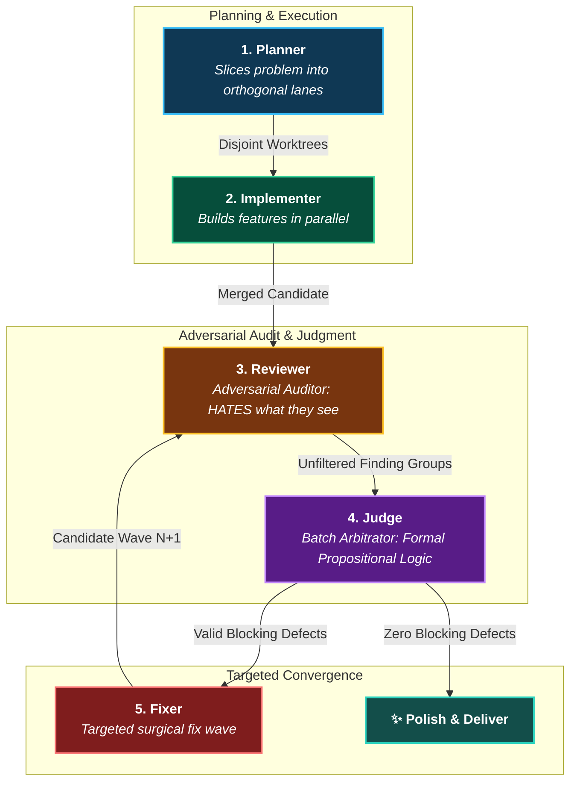
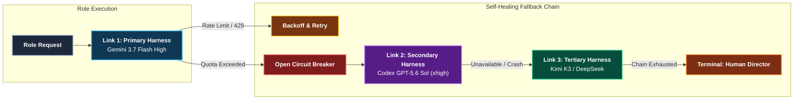

<div align="center">

# 🛡️ Gauntlet Engine

### *Autonomous Multi-Agent Software Engineering with Mechanical Containment & Mathematical Convergence*

[](https://www.rust-lang.org)
[]()
[]()
[-blueviolet.svg)]()
[]()

[The Vision](#-the-vision) •
[The 5 Core Roles](#-the-5-core-roles) •
[Multi-Model Synergy](#-multi-model--multi-harness-synergy) •
[State Machine Workflow](#-state-machine-lifecycle) •
[Quickstart](#-quickstart) •
[Skills](#-skills-integration)

</div>

---

## 🌟 The Vision

Giving an AI agent free rein over a complex codebase usually leads to three catastrophic failure modes:
1. **Workspace Drift & Collisions**: Parallel agents edit files they don't own, hallucinate unrequested refactors, or conflict with each other.
2. **Review Blindspots & Sycophancy**: The same AI that wrote the code reviews its own PR with an inherent bias, missing edge cases and introducing architectural bloat.
3. **Infinite Regression Loops**: Fixing bug A introduces bug B, leading to infinite retries, burned tokens, and degraded code quality.

Inspired by the pioneering philosophy of the Gauntlet Loop ([robonuggets/gauntlet-loop](https://github.com/robonuggets/gauntlet-loop)), **Gauntlet Engine** **formalizes and industrializes** this paradigm into a production-grade, high-assurance engineering platform.

Instead of treating autonomous coding as a loose conversational loop, Gauntlet Engine enforces a **deterministic, invariant-bound state machine**:
- **Zero LLM in the control loop**: State transitions, Git isolation, gate executions, and convergence decisions are 100% mechanical and deterministic.
- **Role specialization**: LLMs fill bounded, sandboxed roles with distinct objective functions (builder vs adversarial auditor vs propositional judge).
- **Mathematical guarantees**: Fix waves are strictly bounded by mathematical convergence ($E_n < \min(E_0 \dots E_{n-1})$), mathematically preventing oscillation and endless loops.

---

## 🎭 The 5 Core Roles

In Gauntlet, no single agent does everything. Tasks are strictly segregated into 5 specialized roles to ensure checks, balances, and zero sycophancy:



| Role | Responsibility | Philosophy |
| :--- | :--- | :--- |
| **`planner`** | Analyzes the contract and partitions the work into mathematically disjoint `[[lanes]]` (`owns` vs `forbidden` file globs). | *Never invent fake parallelism; slice work cleanly.* |
| **`implementer`** | Writes code and local tests inside an isolated, ephemeral Git worktree. | *Fast, focused, confined strictly to owned files.* |
| **`reviewer`** | A read-only adversarial auditor that inspects the complete integrated diff. | *Antoine de Saint-Exupéry: "Perfection is achieved not when there is nothing left to add, but when there is nothing left to take away."* |
| **`judge`** | An independent batch arbitrator that deduplicates root causes and applies formal criteria (`FIX`, `REDESIGN`, `REPORT_ONLY`, `DISMISS`). | *Zero emotion, purely propositional logic.* |
| **`fixer`** | Performs focused surgical repairs on validated root causes in a fresh, orthogonal fix wave. | *Minimal blast radius, net reduction in complexity.* |

---

## ⚡ Multi-Model & Multi-Harness Synergy

Using a single model for both coding and reviewing creates an echo chamber. Gauntlet Engine natively orchestrates **heterogeneous model ensembles** with self-healing fallback chains and circuit breakers:



- **Speed vs Reasoning Pareto Frontier**: Fast, high-context models (like *Gemini 3.7 Flash*) handle high-throughput parallel implementations, while deep reasoning models (*GPT-5.6 Sol / Kimi K3*) perform adversarial audits and judgments.
- **Circuit Breaker Resilience**: If an API provider suffers outages, rate limits, or auth expiration, Gauntlet trips a per-run circuit breaker and seamlessly cascades to the next configured provider without losing state.

---

## 🔄 State Machine Lifecycle

Gauntlet Engine runs a deterministic finite state machine where every transition is recorded in `state.json` and `report.md`:

```mermaid
flowchart TD
    INIT["<b>INIT</b><br><i>Load Contract & Base Commit</i>"] --> PLAN["<b>PLAN</b><br><i>Slice Orthogonal Lanes</i>"]
    
    subgraph Parallel Worktree Execution
        PLAN --> L1["<b>LANE 1</b><br><i>Worktree 1</i>"]
        PLAN --> L2["<b>LANE 2</b><br><i>Worktree 2</i>"]
    end
    
    L1 --> IMP["<b>IMPLEMENT</b><br><i>Workers complete diffs</i>"]
    L2 --> IMP
    
    IMP --> INSP["<b>INSPECT</b><br><i>Verify owns & drift</i>"]
    INSP -->|Pass| INT["<b>INTEGRATE</b><br><i>Merge into integration branch</i>"]
    INSP -->|Containment Breach| B_SAFE["<b>✖ BLOCKED_SAFETY</b><br><i>Drift / Forbidden edit</i>"]
    
    INT --> GATES["<b>GATES</b><br><i>Run deterministic test suite</i>"]
    GATES -->|Pass| REV["<b>REVIEW</b><br><i>Adversarial code audit</i>"]
    GATES -->|Fail| B_GATE["<b>✖ BLOCKED_GATE</b><br><i>Gate failure</i>"]
    
    REV --> JUDGE["<b>JUDGE</b><br><i>Batch root-cause judgment</i>"]
    
    JUDGE -->|No Blocking Claims| POLISH["<b>POLISH</b><br><i>Clean candidate pass</i>"]
    JUDGE -->|Defects to Fix (Wave N+1)| PFIX["<b>PLAN_FIX</b><br><i>Coalesce & Re-slice lanes</i>"]
    JUDGE -->|Stalled / Oscillating| B_CONV["<b>✖ BLOCKED_CONVERGENCE</b><br><i>Defect count did not drop</i>"]
    JUDGE -->|REDESIGN Verdict| B_ARCH["<b>✖ BLOCKED_ARCHITECTURE</b><br><i>Architectural redesign</i>"]
    
    PFIX -->|Next Wave| L1
    
    POLISH --> DELIVER["<b>DELIVER</b><br><i>Rebase & final verification</i>"]
    DELIVER --> READY["<b>✔ READY</b><br><i>Clean delivery on target</i>"]

    style INIT fill:#1e293b,stroke:#94a3b8,stroke-width:2px,color:#ffffff
    style PLAN fill:#0f3854,stroke:#38bdf8,stroke-width:2px,color:#ffffff
    style L1 fill:#064e3b,stroke:#34d399,stroke-width:2px,color:#ffffff
    style L2 fill:#064e3b,stroke:#34d399,stroke-width:2px,color:#ffffff
    style IMP fill:#064e3b,stroke:#34d399,stroke-width:2px,color:#ffffff
    style INSP fill:#134e4a,stroke:#2dd4bf,stroke-width:2px,color:#ffffff
    style INT fill:#0f3854,stroke:#38bdf8,stroke-width:2px,color:#ffffff
    style GATES fill:#312e81,stroke:#818cf8,stroke-width:2px,color:#ffffff
    style REV fill:#78350f,stroke:#fbbf24,stroke-width:2px,color:#ffffff
    style JUDGE fill:#581c87,stroke:#c084fc,stroke-width:2px,color:#ffffff
    style PFIX fill:#7f1d1d,stroke:#f87171,stroke-width:2px,color:#ffffff
    style POLISH fill:#134e4a,stroke:#2dd4bf,stroke-width:2px,color:#ffffff
    style DELIVER fill:#065f46,stroke:#34d399,stroke-width:2px,color:#ffffff
    style READY fill:#047857,stroke:#10b981,stroke-width:3px,color:#ffffff
    
    style B_SAFE fill:#450a0a,stroke:#ef4444,stroke-width:2px,color:#ffffff
    style B_GATE fill:#450a0a,stroke:#ef4444,stroke-width:2px,color:#ffffff
    style B_CONV fill:#450a0a,stroke:#ef4444,stroke-width:2px,color:#ffffff
    style B_ARCH fill:#450a0a,stroke:#ef4444,stroke-width:2px,color:#ffffff
```

### The Iron Law of Convergence: $E_n < \min(E_0 \dots E_{n-1})$
To prevent endless loops, fix waves are allowed **only if the number of blocking defects strictly decreases compared to the best historical round**. If an agent oscillates ($3 \to 1 \to 2$ defects), the engine immediately halts with `BLOCKED_CONVERGENCE` for human triage.

---

## 🚀 Quickstart

### 1. Build and Install (Rust)

Gauntlet is built in 100% production-grade, zero-panic Rust with typed error handling:

```bash
# Build release binary
cargo build --release

# Install to your PATH
cargo install --path .
```

*(Alternatively, run the native wrapper directly: `./gauntlet <mission.md>`)*

---

### 2. Write a Mission Contract (`missions/my-feature.md`)

A Gauntlet mission combines TOML frontmatter (mechanical rules & lanes) and Markdown (human contracts):

```markdown
+++
slug = "cache-service"

[[repos]]
path = "."
target_branch = "main"
gates = [
  "cargo test",
  "cargo clippy --all-targets -- -D warnings"
]

[[lanes]]
id = "L1"
owns = ["src/cache/**", "tests/test_cache.rs"]
forbidden = ["src/api/**"]
tests = ["cargo test --test test_cache"]
brief = "Implement bounded LRU cache with eviction logic."

[[lanes]]
id = "L2"
owns = ["src/api/**", "tests/test_api.rs"]
forbidden = ["src/cache/**"]
tests = ["cargo test --test test_api"]
brief = "Expose cache endpoints over HTTP."
+++

# Mission Objective
Implement the cache service and REST endpoints with zero regressions.

## Acceptance Criteria (AC)
- AC-1: Cache supports O(1) concurrent get/put operations.
- AC-2: Eviction policy triggers deterministically when capacity is reached.

## Invariants (INV) - Inviolable Rules
- INV-1: Zero unwrap(), expect(), or panic! in production code.
- INV-2: Full thread safety under high concurrency.

## Non-Goals (NG)
- NG-1: Distributed Redis/Memcached clustering.
```

---

### 3. Run the Gauntlet

```bash
# 1. Dry run: Verify lane orthogonality and worktree allocation without modifying git
gauntlet --dry-run missions/my-feature.md

# 2. Super-Auto mode: Intelligent Pareto routing based on mission risk
gauntlet --profile auto missions/my-feature.md

# 3. Pure AGY mode: Run all roles via Gemini 3.7 Flash High
gauntlet --config gauntlet.agy.toml missions/my-feature.md

# 4. Interactive mode: Pauses for human confirmation at key milestones
gauntlet --interactive missions/my-feature.md
```

---

## 🤖 Skills Integration

Gauntlet Engine includes two dedicated skills for agentic IDEs (**Antigravity, Claude Code, Cursor, Reasonix**):

```
.agents/skills/
├── gauntlet-architect/    # Slices contracts, defines blast radius, partitions orthogonal lanes
└── gauntlet-pilot/        # Supervises execution, manages checkpoints, handles triage & delivery
```

### Install in your Agent environment
```bash
mkdir -p ~/.agents/skills
cp -r skills/gauntlet-architect ~/.agents/skills/
cp -r skills/gauntlet-pilot ~/.agents/skills/
```

- **Invoke `gauntlet-architect`**: When you have an idea, PRD, or feature request and want a formal, orthogonal mission contract created.
- **Invoke `gauntlet-pilot`**: When you want the agent to execute, supervise, monitor, and deliver a mission into your repository.

---

## ⚙️ Configuration & Profiles

Gauntlet merges configuration in the following order:
1. **Built-in Defaults** (embedded in the engine)
2. **Project Config**: `./gauntlet.toml`
3. **Mission Config**: `<mission_dir>/gauntlet.toml`
4. **CLI Flag**: `--config <custom.toml>`

### Ready-to-use Configurations:
- **`gauntlet.toml`**: Multi-harness setup combining AGY, Codex GPT-5.6, CMD, and Kimi K3.
- **`gauntlet.agy.toml`**: High-throughput configuration running 100% on AGY (Gemini 3.7 Flash High).

---

## 🧪 Safety & Test Suite

Gauntlet Engine is tested to the highest assurance standards:
- **100% Pure Rust**: Zero legacy dependencies, single static binary.
- **0 `unwrap()` / `expect()` / `panic!`** in all non-test Rust modules.
- **Poison-Resilient Mutexes**: Thread locks automatically recover from poisoned states.
- **136 Tests Passed (0 Failures)** across state machines, worktree containment, and fallback executors.
- **0 Clippy Warnings** (`cargo clippy --all-targets -- -D warnings`).

---

## 🙏 Acknowledgments & Credits

**Gauntlet Engine** builds upon, formalizes, and extends the foundational concepts introduced by [robonuggets/gauntlet-loop](https://github.com/robonuggets/gauntlet-loop). We expand the original Python proof-of-concept into a production-grade, 100% Rust high-performance engine with mechanical worktree isolation, adversarial multi-role auditing, and bounded mathematical convergence.

---

## 📄 License

Dual-licensed under either of [Apache License, Version 2.0](LICENSE-APACHE) or [MIT License](LICENSE-MIT) at your option.
