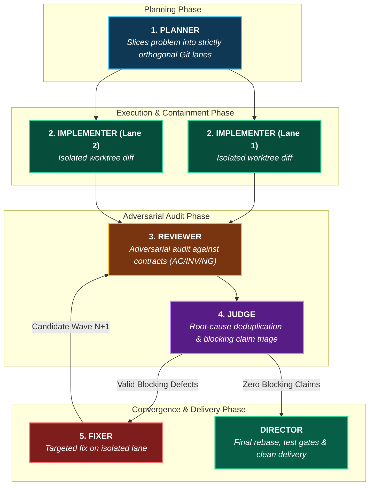
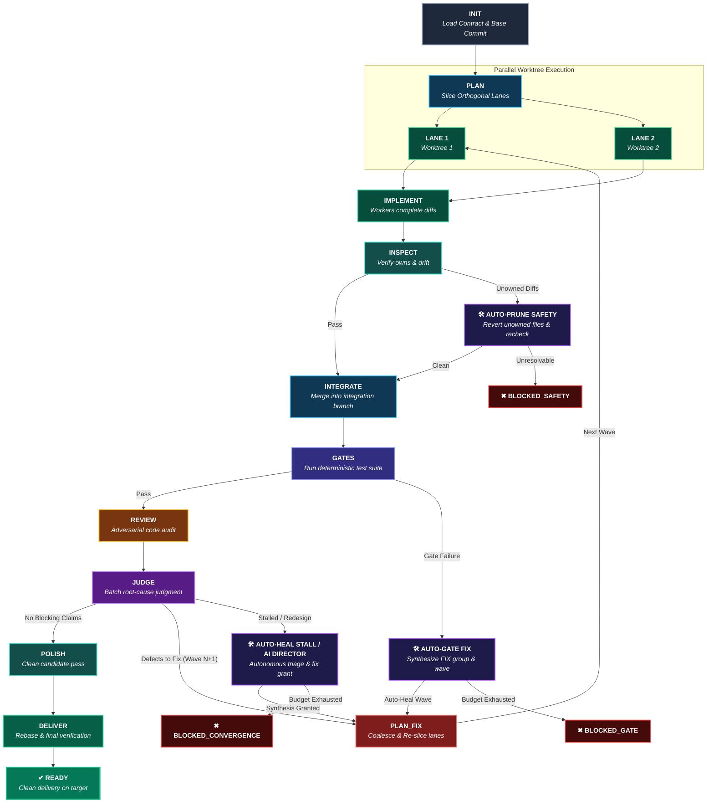

<div align="center">

# 🛡️ Gauntlet Engine

### *Autonomous Multi-Agent Software Engineering with Mechanical Containment & Mathematical Convergence*

[](https://www.rust-lang.org)
[]()
[]()
[]()
[]()

[The Vision](#-the-vision) •
[The 5 Core Roles](#-the-5-core-roles) •
[Supported Harnesses](#-supported-harness-adapters) •
[Configurable Synergy](#-configurable-multi-model--multi-harness-synergy) •
[Self-Healing & Remediation](#-self-healing--autonomous-remediation) •
[State Machine Workflow](#-state-machine-lifecycle) •
[Quickstart](#-quickstart) •
[Skills](#-skills-integration)

</div>

---

## 🌟 The Vision

### Why Autonomous Engineering Demands Mechanical Containment

When developers hand a complex software task to a single AI agent, failure usually stems from three failure modes:
1. **Scope Bloat & Hallucinated Regressions**: The agent edits files outside its mandate, introduces subtle syntax breaks, or refactors unrelated modules.
2. **Self-Review Confirmation Bias**: An agent that wrote a flawed implementation is statistically incapable of finding its own subtle logical defects during a self-check.
3. **Infinite Fix Loops**: When prompted to fix an issue, an agent introduces another bug, oscillating indefinitely between errors.

### The Gauntlet Paradigm: Industrialization of Multi-Agent Engineering

**Gauntlet Engine** turns autonomous software engineering into a **deterministic, invariant-bound assembly line**:
- **Mechanical Containment**: Agents run in isolated Git worktrees. Diffs touching files outside strict lane ownership (`owns`) or touching forbidden paths (`forbidden`) are **mechanically rejected** before they ever hit the codebase.
- **Adversarial Tri-Role Auditing**: Implementation diffs are independently audited by an adversarial `reviewer` and filtered through a propositional `judge` that deduplicates root causes and rejects non-actionable claims.
- **Mathematical Convergence Guarantee**: Each fix wave must strictly reduce the number of blocking defects ($E_n < \min(E_0 \dots E_{n-1})$). If defect counts oscillate or stall, Gauntlet halts immediately to protect the repository.

---

## 🎭 The 5 Core Roles

In Gauntlet, no agent is a generalist. Every step is executed by a specialized persona with a dedicated system prompt, capability profile, and output schema:



| Role | Access | Responsibility |
| :--- | :--- | :--- |
| **`planner`** | Read-Only | Analyzes objectives, Acceptance Criteria (AC), Invariants (INV), and defines disjoint `owns` file scopes. |
| **`implementer`** | Write (Worktree) | Writes code and local tests strictly within the assigned Git worktree. |
| **`reviewer`** | Read-Only | Performs adversarial code audit against Acceptance Criteria and Invariants. |
| **`judge`** | Read-Only | Groups findings by root cause, discards style nitpicks, determines blocking defects. |
| **`fixer`** | Write (Worktree) | Resolves validated blocking defects in a fresh, isolated fix worktree. |
| **`director`** | Human / Agent | Supervises milestones, reviews architectural redesign proposals, approves deliveries. |

---

## 🔌 Supported Harness Adapters

Gauntlet Engine connects directly to all major agentic CLIs and models through a unified, zero-overhead subprocess bridge:

| Harness | CLI Command | Supported Frontier Models | Capabilities | Best Suited For |
| :--- | :--- | :--- | :--- | :--- |
| **`agy`** | `agy` | `google/gemini-3.7-flash`, `gemini-3.7-flash-lite`, `gemini-pro` | Read & Write, Agentic Tool Use | Ultra-fast parallel implementation & planning |
| **`cmd`** | `cmd` | **55+ models**: `claude-sonnet-5`, `gpt-5.6-sol`, `gpt-5.6-luna`, `deepseek-v4-pro`, `qwen3.8-max`, `glm-5.3`, `minimax-m3` | Read & Write, `--yolo`, `--permission-mode plan` | Universal multi-model hub, adversarial audit, judgment |
| **`codex`** | `codex` | `gpt-5.6-sol`, `gpt-5.6-terra`, `gpt-5.5`, `gpt-5.3-codex` (Reasoning: `low`, `medium`, `high`, `xhigh`) | Read & Write, Headless JSON streaming | Deep propositional reasoning, invariant verification |
| **`kimi`** | `kimi` | `moonshotai/kimi-k3`, `kimi-k2.7-code` (1M token context) | Read & Write, Non-interactive prompt mode | Massive codebase ingestion, full-repo audits |
| **`reasonix`** | `reasonix` | `deepseek/deepseek-v4-flash`, `deepseek-v4-pro` | Read & Write, Ephemeral sessions | Cost-effective mathematical reasoning & fixes |
| **`human`** | Interactive | Live developer console | Interactive stdin/stdout | Critical architecture decisions, final delivery review |
| **`echo`** | In-Memory | Deterministic mock engine | Instant mock responses | Dry runs, automated CI test suites |

---

## 🤝 Configurable Multi-Model & Multi-Harness Synergy

Using a single model for both implementation and audit creates an echo chamber. Gauntlet Engine enables complete freedom to **mix and match any model and harness for any role**, with **zero-delay immediate failover** (no exponential backoff sleeps—immediate cascade to the next link for maximum throughput):

```mermaid
flowchart LR
    subgraph Role Invocation
        R["<b>Role Task</b>"] --> H1["<b>Link 1 (Primary)</b><br>Gemini 3.7 Flash High"]
    end

    subgraph Immediate Zero-Delay Failover
        H1 -->|"Rate Limit / 429"| CB1["<b>Instant Cascade</b><br><i>0s Backoff</i>"]
        CB1 --> H2["<b>Link 2 (Secondary)</b><br>CommandCode Claude Sonnet 5"]
        H2 -->|"Unavailable / Error"| H3["<b>Link 3 (Tertiary)</b><br>Codex GPT-5.6 Sol (xhigh)"]
        H3 -->|"Chain Exhausted"| H4["<b>Terminal Fallback</b><br>Human Director"]
    end

    style R fill:#1e293b,stroke:#94a3b8,stroke-width:2px,color:#ffffff
    style H1 fill:#0f3854,stroke:#38bdf8,stroke-width:2px,color:#ffffff
    style CB1 fill:#7f1d1d,stroke:#f87171,stroke-width:2px,color:#ffffff
    style H2 fill:#581c87,stroke:#c084fc,stroke-width:2px,color:#ffffff
    style H3 fill:#064e3b,stroke:#34d399,stroke-width:2px,color:#ffffff
    style H4 fill:#7c2d12,stroke:#fb923c,stroke-width:2px,color:#ffffff
```



### Sample Role & Failover Topology

| Role | Primary Harness & Model | Secondary Failover | Tertiary Failover | Rationale & Capability Profile |
| :--- | :--- | :--- | :--- | :--- |
| **`planner`** | `kimi` : `kimi-k3` | `cmd` : `xai/grok-4.6` | `codex` : `gpt-5.6-sol` (`high`) | Deep architectural reasoning & massive context to slice problems into orthogonal lanes |
| **`implementer`** | `agy` : `gemini-3.7-flash` | `cmd` : `deepseek-v4-flash` | `cmd` : `claude-sonnet-5` | High-velocity code generation in parallel worktrees with minimal token latency |
| **`reviewer`** | `cmd` : `xai/grok-4.6` | `kimi` : `kimi-k3` | `codex` : `gpt-5.6-sol` (`high`) | Relentless adversarial code audit against Acceptance Criteria & Invariants; zero bias |
| **`judge`** | `codex` : `gpt-5.6-sol` (`xhigh`) | `cmd` : `claude-sonnet-5` | `cmd` : `deepseek-v4-pro` | Strict propositional logic, root-cause deduplication & non-actionable claim triage |
| **`fixer`** | `cmd` : `claude-sonnet-5` | `agy` : `gemini-3.7-flash` | `cmd` : `deepseek-v4-flash` | High-precision surgical repairs on validated root causes in isolated fix lanes |
| **`director`** | `human` : Interactive Console | — | — | Human checkpoint for redesign approvals & final delivery authorization |

---

### Mix & Match Configuration Recipes

### Recipe 1: The Frontier Cross-Provider Ensemble ([`gauntlet.toml`](file:///Users/jhiver/aios/projects/gauntlet/gauntlet.toml))
Combining Gemini for high-speed implementation, Claude Sonnet 5 for adversarial review, and GPT-5.6 Sol for formal judgment:

```toml
[roles.implementer]
chain = [
  { harness = "agy", model = "google/gemini-3.7-flash" },
  { harness = "cmd", model = "claude-sonnet-5" },
]

[roles.reviewer]
chain = [
  { harness = "cmd", model = "claude-sonnet-5" },
  { harness = "codex", model = "gpt-5.6-sol", effort = "high" },
]

[roles.judge]
chain = [
  { harness = "codex", model = "gpt-5.6-sol", effort = "xhigh" },
  { harness = "cmd", model = "claude-sonnet-5" },
]
```

### Recipe 2: CommandCode 55-Model Multi-Hub ([`gauntlet.cmd.toml`](file:///Users/jhiver/aios/projects/gauntlet/gauntlet.cmd.toml))
Leveraging CommandCode's unified CLI to route different models per role without setting up separate tooling:

```toml
[roles.implementer]
chain = [{ harness = "cmd", model = "claude-sonnet-5" }]

[roles.reviewer]
chain = [
  { harness = "cmd", model = "gpt-5.6-sol", effort = "high" },
  { harness = "cmd", model = "deepseek/deepseek-v4-pro" },
]

[roles.judge]
chain = [{ harness = "cmd", model = "gpt-5.6-sol", effort = "high" }]
```

### Recipe 3: Pure AGY Stack ([`gauntlet.agy.toml`](file:///Users/jhiver/aios/projects/gauntlet/gauntlet.agy.toml))
High-throughput 100% Google Gemini configuration:

```toml
[roles.implementer]
chain = [{ harness = "agy", model = "google/gemini-3.7-flash" }]

[roles.reviewer]
chain = [{ harness = "agy", model = "google/gemini-3.7-flash" }]

[roles.judge]
chain = [{ harness = "agy", model = "google/gemini-3.7-flash" }]
```

### Zero-Downtime Immediate Failover Policy
```toml
[fallback]
on_rate_limit = "next"            # Instant cascade to next link on 429/rate limit
on_quota = "next_and_break"       # Trip circuit breaker and cascade immediately
on_model_unavailable = "next"     # Skip unavailable models instantly
on_timeout = "retry_once_then_next"
on_crash = "retry_once_then_next"
max_attempts_per_task = 3
```

---

## 🛠️ Self-Healing & Autonomous Remediation

Autonomous engineering often fails when a minor defect (a lint error, a missing test file, or an accidental touch of an unowned file) causes a hard crash. Gauntlet Engine features a **bounded self-healing engine** (`[policy.on_blocked]`):

| Self-Healing Trigger | Autonomous Remediation Action | Budget & Safety Bound |
| :--- | :--- | :--- |
| **`AUTO_PRUNE_SAFETY`** | If a worker modifies or creates files outside its `owns` scope, Gauntlet mechanically reverts the unowned files (`git checkout -- <file>`) and re-runs containment checks. | Zero-leakage: if unowned edits cannot be cleanly isolated, lane is rejected. |
| **`AUTO_GATE_FIX`** | If deterministic gates (`cargo test`, `cargo clippy`) fail during integration, compiler and test errors are synthesized into structured `FIX` finding groups (`contract_id: "GATES"`), launching an autonomous fix wave. | Bounded by `auto_heal_budget` (default: 2 attempts) to prevent infinite loops. |
| **`STALL_SYNTHESIS`** | If defect counts stall or oscillate, Gauntlet grants an auto-healing synthesis wave with prior failure context before hard-blocking. | Strictly bounded by `max_total_waves` and `auto_heal_budget`. |
| **`AI_DIRECTOR_FALLBACK`** | When `on_blocked = "director"`, an AI model in the director chain (e.g. `gpt-5.6-sol`, `claude-sonnet-5`) autonomously evaluates failure diagnostics and decides whether to grant a wave or halt. | Configurable chain: AI Model $\to$ Human Fallback. |

### Configuration Options
```toml
[policy]
on_blocked = "auto_heal"      # "auto_heal" (autonomous repair), "director" (AI/Human triage), "halt" (strict CI)
auto_heal_budget = 2          # Maximum auto-remediation attempts before terminal halt
```

---

## 🔄 State Machine Lifecycle

Gauntlet Engine runs a deterministic finite state machine where every transition is recorded in `state.json` and `report.md`:



### The Iron Law of Convergence: $E_n < \min(E_0 \dots E_{n-1})$
To prevent endless loops, fix waves are allowed **only if the number of blocking defects strictly decreases compared to the best historical round** or if an autonomous recovery budget is actively granted. If an agent oscillates ($3 \to 1 \to 2$ defects) and exhausts its self-healing budget, the engine immediately halts with `BLOCKED_CONVERGENCE` for human triage.

---

## 🚀 Quickstart

### 1. Build and Install (Rust)

Gauntlet is built in 100% production-grade, zero-panic Rust with typed error handling:

```bash
# Build release binary
cargo build --release

# Install to your PATH
cargo install --path .
```

*(Alternatively, run the native wrapper directly: `./gauntlet <mission.md>`)*

---

### 2. Write a Mission Contract (`missions/my-feature.md`)

A Gauntlet mission combines TOML frontmatter (mechanical rules & lanes) and Markdown (human contracts):

```markdown
+++
slug = "cache-service"

[[repos]]
path = "."
target_branch = "main"
gates = [
  "cargo test",
  "cargo clippy --all-targets -- -D warnings"
]

[[lanes]]
id = "L1"
owns = ["src/cache/**", "tests/test_cache.rs"]
forbidden = ["src/api/**"]
tests = ["cargo test --test test_cache"]
brief = "Implement bounded LRU cache with eviction logic."

[[lanes]]
id = "L2"
owns = ["src/api/**", "tests/test_api.rs"]
forbidden = ["src/cache/**"]
tests = ["cargo test --test test_api"]
brief = "Expose cache endpoints over HTTP."
+++

# Mission Objective
Implement the cache service and REST endpoints with zero regressions.

## Acceptance Criteria (AC)
- AC-1: Cache supports O(1) concurrent get/put operations.
- AC-2: Eviction policy triggers deterministically when capacity is reached.

## Invariants (INV) - Inviolable Rules
- INV-1: Zero unwrap(), expect(), or panic! in production code.
- INV-2: Full thread safety under high concurrency.

## Non-Goals (NG)
- NG-1: Distributed Redis/Memcached clustering.
```

---

### 3. Run the Gauntlet

```bash
# 1. Dry run: Verify lane orthogonality and worktree allocation without modifying git
gauntlet --dry-run missions/my-feature.md

# 2. Super-Auto mode: Intelligent Pareto routing based on mission risk
gauntlet --profile auto missions/my-feature.md

# 3. Pure AGY mode: Run all roles via Gemini 3.7 Flash High
gauntlet --config gauntlet.agy.toml missions/my-feature.md

# 4. Interactive mode: Pauses for human confirmation at key milestones
gauntlet --interactive missions/my-feature.md
```

---

## 🤖 Skills Integration

Gauntlet Engine includes two dedicated skills for agentic IDEs (**Antigravity, Claude Code, Cursor, Reasonix**):

```
.agents/skills/
├── gauntlet-architect/    # Slices contracts, defines blast radius, partitions orthogonal lanes
└── gauntlet-pilot/        # Supervises execution, manages checkpoints, handles triage & delivery
```

### Install in your Agent environment
```bash
mkdir -p ~/.agents/skills
cp -r skills/gauntlet-architect ~/.agents/skills/
cp -r skills/gauntlet-pilot ~/.agents/skills/
```

- **Invoke `gauntlet-architect`**: When you have an idea, PRD, or feature request and want a formal, orthogonal mission contract created.
- **Invoke `gauntlet-pilot`**: When you want the agent to execute, supervise, monitor, and deliver a mission into your repository.

---

## ⚙️ Configuration & Profiles

Gauntlet merges configuration in the following order:
1. **Built-in Defaults** (embedded in the engine)
2. **Project Config**: `./gauntlet.toml`
3. **Mission Config**: `<mission_dir>/gauntlet.toml`
4. **CLI Flag**: `--config <custom.toml>`

### Ready-to-use Configurations:
- **`gauntlet.toml`**: Multi-harness setup combining AGY, Codex GPT-5.6, CMD, and Kimi K3.
- **`gauntlet.agy.toml`**: High-throughput configuration running 100% on AGY (Gemini 3.7 Flash High).

---

## 🧪 Safety & Test Suite

Gauntlet Engine is tested to the highest assurance standards:
- **100% Pure Rust**: Zero legacy dependencies, single static binary.
- **0 `unwrap()` / `expect()` / `panic!`** in all non-test Rust modules.
- **Poison-Resilient Mutexes**: Thread locks automatically recover from poisoned states.
- **136 Tests Passed (0 Failures)** across state machines, worktree containment, and fallback executors.
- **0 Clippy Warnings** (`cargo clippy --all-targets -- -D warnings`).

---

## 🙏 Acknowledgments & Credits

**Gauntlet Engine** builds upon, formalizes, and extends the foundational concepts introduced by [robonuggets/gauntlet-loop](https://github.com/robonuggets/gauntlet-loop). We expand the original Python proof-of-concept into a production-grade, 100% Rust high-performance engine with mechanical worktree isolation, adversarial multi-role auditing, and bounded mathematical convergence.

---

## 📄 License

Dual-licensed under either of [Apache License, Version 2.0](LICENSE-APACHE) or [MIT License](LICENSE-MIT) at your option.
